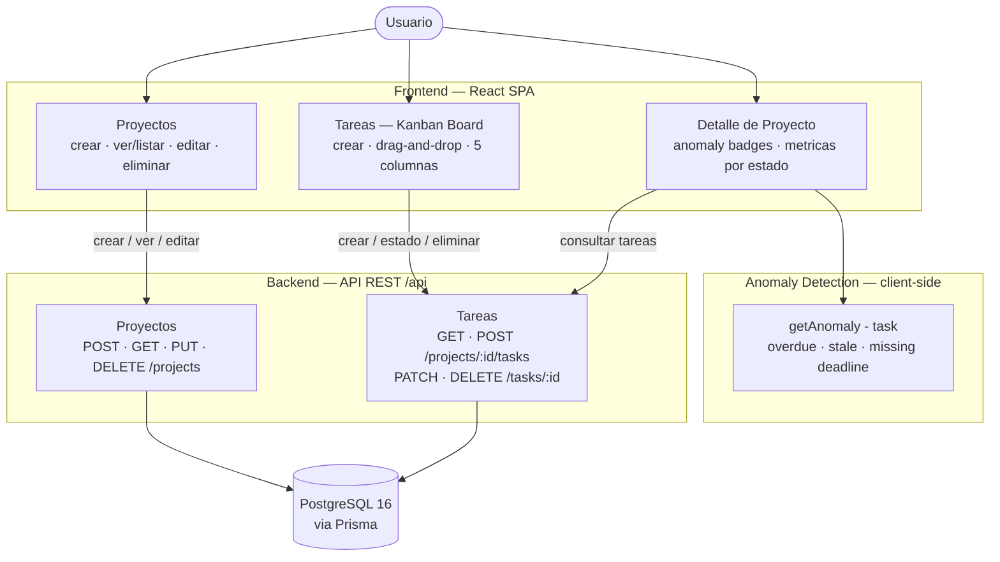
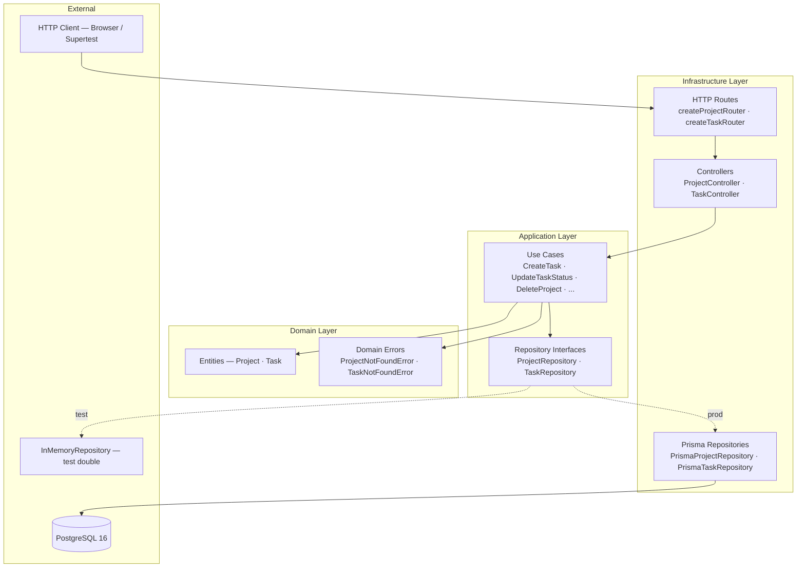
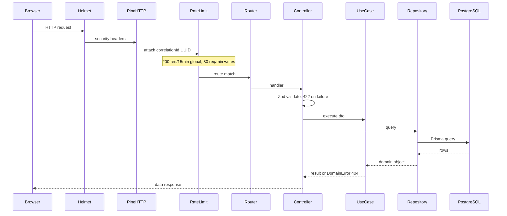
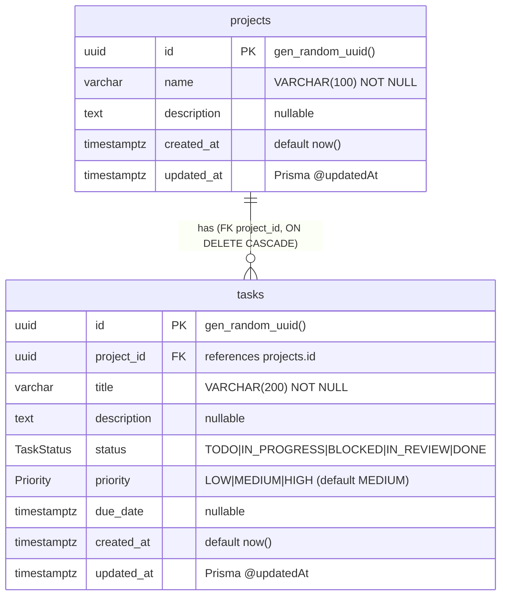

# Task Management API

A full-stack task management application built as a senior technical assessment. Features a Kanban board with drag-and-drop, five workflow statuses, inline anomaly detection, structured logging, and a hexagonal backend architecture with comprehensive test coverage.


---

## Quick Start

```bash
git clone https://github.com/MiguelFuquene1024/project-task-management-api.git
cd project-task-management-api
docker compose up --build
```

| Service   | URL                              |
|-----------|----------------------------------|
| Frontend  | http://localhost:5173            |
| API       | http://localhost:3000            |
| Swagger   | http://localhost:3000/api/docs   |
| Postgres  | localhost:5432                   |

On first boot, `entrypoint.sh` runs `prisma db push` + `prisma db seed`, loading 3 projects and 17 tasks distributed across all five statuses.

### Running tests

```bash
cd backend
npm install
npm test
```

---

## Stack

### Backend

| Concern          | Choice                  | Rationale                                                          |
|------------------|-------------------------|--------------------------------------------------------------------|
| Runtime          | Node.js 20 + TypeScript | Type safety enforced end-to-end; `strict` mode enabled             |
| Framework        | Express 4               | Minimal footprint; easy to wire hexagonal ports without lock-in    |
| ORM              | Prisma 5                | Type-safe query builder with schema-as-source-of-truth             |
| Database         | PostgreSQL 16           | Relational integrity; `onDelete: Cascade` for project→task cleanup |
| Validation       | Zod                     | Schema-first; errors mapped to structured 422 responses            |
| Logging          | Pino + pino-http        | Structured JSON in production; `correlationId` per request         |
| Rate limiting    | express-rate-limit      | Two-tier: 200 req/15 min global, 30 req/min on write routes        |
| API docs         | Swagger / OpenAPI 3     | JSDoc annotations on routes; auto-generated UI at `/api/docs`      |
| Testing          | Jest + Supertest        | Unit (use cases) + integration (HTTP) via injected InMemory repos  |

### Frontend

| Concern          | Choice                  | Rationale                                                          |
|------------------|-------------------------|--------------------------------------------------------------------|
| UI framework     | React 18                | Component model fits Kanban column/card hierarchy naturally        |
| Build tool       | Vite 5                  | Sub-second HMR; native ESM                                         |
| Styling          | Tailwind CSS 3          | Utility-first; dark theme consistent without a CSS cascade         |
| Server state     | TanStack Query v5       | Automatic caching, background refetch, and optimistic updates      |
| Drag-and-drop    | dnd-kit                 | Accessible by default; pointer sensor with 6px activation fence    |
| Routing          | React Router 6          | File-convention-free; layout nesting for project/task pages        |

---

## Architecture

### System Overview



### Hexagonal (Ports & Adapters)

Business logic lives entirely in the Domain and Application layers. Nothing in those layers imports from Express, Prisma, or any framework. The Infrastructure layer is the only place that knows about external systems.



The key invariant: **Use Cases depend on the `Repository` interface, never on `PrismaRepository`**. This makes them testable with `InMemoryRepository` without any mocking framework or real database.

### Request Lifecycle



---

## Database Schema



---

## Project Structure

```
project-task-management-api/
├── backend/
│   ├── prisma/
│   │   ├── schema.prisma          # Source of truth for DB schema + enums
│   │   └── seed.ts                # 3 projects, 17 tasks across all statuses
│   └── src/
│       ├── modules/
│       │   ├── projects/
│       │   │   ├── domain/        # Project entity, ProjectRepository interface, errors
│       │   │   ├── application/   # Use cases + InMemoryProjectRepository (fakes)
│       │   │   └── infrastructure/# PrismaProjectRepository, Controller, Routes
│       │   └── tasks/
│       │       ├── domain/        # Task entity, TaskRepository interface, errors
│       │       ├── application/   # Use cases + InMemoryTaskRepository (fakes)
│       │       └── infrastructure/# PrismaTaskRepository, Controller, Routes
│       └── shared/
│           ├── lib/               # Prisma client singleton
│           ├── logger/            # Pino instance
│           ├── middleware/        # requestLogger (pino-http), rateLimiter, errorHandler
│           └── swagger/           # OpenAPI spec generation
└── frontend/
    └── src/
        ├── modules/
        │   ├── projects/          # ProjectsPage, ProjectDetailPage, hooks
        │   └── tasks/
        │       ├── components/    # TaskBoard, TaskColumn, TaskCard, TaskFormModal
        │       └── hooks/         # useTasks (TanStack Query)
        └── shared/
            ├── components/        # Badge, EmptyState, Layout
            └── types/             # Shared TypeScript types (Task, Project, TaskStatus)
```

---

## Architectural Decisions

### ADR-1: Hexagonal architecture over layered MVC

Use cases (`CreateTask`, `UpdateTaskStatus`, etc.) are plain TypeScript classes that receive repository interfaces via constructor injection. They have zero knowledge of Express or Prisma. This means the application core can be unit-tested without spinning up HTTP servers or databases.

**Trade-off**: More files per feature. Accepted because the assessment explicitly targets senior-level design; the structure pays off at scale.

### ADR-2: Route factory pattern for testability

`createProjectRouter(repo)` and `createTaskRouter(taskRepo, projectRepo)` accept repository interfaces. The production export at module bottom injects the Prisma implementations:

```typescript
export const projectRoutes = createProjectRouter(new PrismaProjectRepository(prisma));
```

Integration tests inject `InMemoryProjectRepository` instead. No mocking framework needed; no change to `app.ts`.

### ADR-3: InMemoryRepository as the test double strategy

Rather than mocking Prisma calls, each module ships an `InMemory*Repository` that implements the same interface. This enforces the interface contract at the TypeScript level — if a new method is added to `TaskRepository`, both `PrismaTaskRepository` and `InMemoryTaskRepository` must implement it or the build fails.

### ADR-4: Five Kanban statuses (including BLOCKED)

Standard Kanban uses three columns. This project adds `BLOCKED` and `IN_REVIEW` to reflect real engineering workflows. `BLOCKED` was chosen over `CANCELLED` because blocked tasks still belong to the active backlog; cancelled tasks warrant deletion, not a status.

### ADR-5: Inline anomaly detection without a backend endpoint

Anomaly logic runs as a pure client-side function `getAnomaly(task: Task): Anomaly | null` inside `TaskCard`. Three anomaly types:

| Badge | Trigger |
|-------|---------|
| `Xd overdue` | `dueDate` is in the past and status ≠ DONE |
| `No update Xd` | No `updatedAt` activity in ≥ 7 days (TODO / IN_PROGRESS only) |
| `Missing deadline` | Priority is HIGH with no `dueDate` set |

This avoids a dedicated AI/analytics endpoint while providing actionable signals on every card. The function is suppressed during drag overlay to avoid layout shifts.

### ADR-6: Two-tier rate limiting

A global limiter (200 req / 15 min) protects all routes. A tighter write limiter (30 req / 1 min) is applied only to `POST`, `PUT`, `PATCH`, `DELETE` routes. Read-heavy Kanban board refreshes are not penalized by write quotas.

### ADR-7: Structured logging with correlationId

Every request receives a UUID `correlationId` injected by `pino-http`. The same ID propagates to the error handler, making it trivial to correlate a client-visible error with the server log entry that produced it. Log level is derived from HTTP status: `info` for 2xx, `warn` for 4xx, `error` for 5xx.

---

## Test Strategy

```
62 tests total
├── 35 unit tests       (application layer — use cases only)
│   ├── 5 × CreateProject, FindProjectById, ListProjects, UpdateProject, DeleteProject
│   └── 6 × CreateTask, FindTaskById, ListTasksByProject, UpdateTask, UpdateTaskStatus, DeleteTask
└── 27 integration tests (infrastructure layer — HTTP via Supertest)
    ├── 10 × Projects API
    └── 17 × Tasks API (includes BLOCKED and IN_REVIEW status scenarios)
```

Unit tests exercise business rules (validation, error propagation, state transitions) with in-memory fakes — zero I/O.

Integration tests exercise the full HTTP stack (routing, middleware, controller, use case, repository) with injected `InMemoryRepository` — no real database needed, no network latency.
